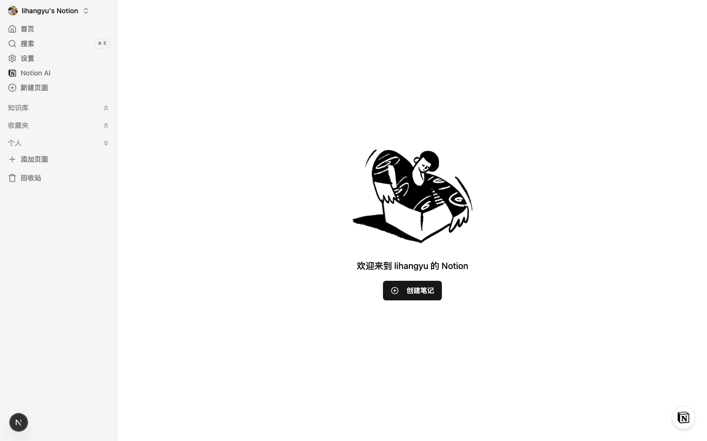
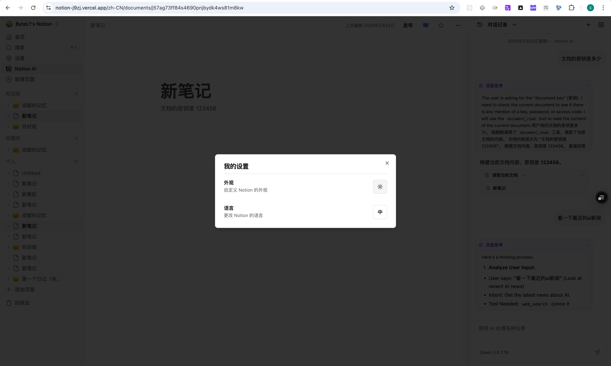
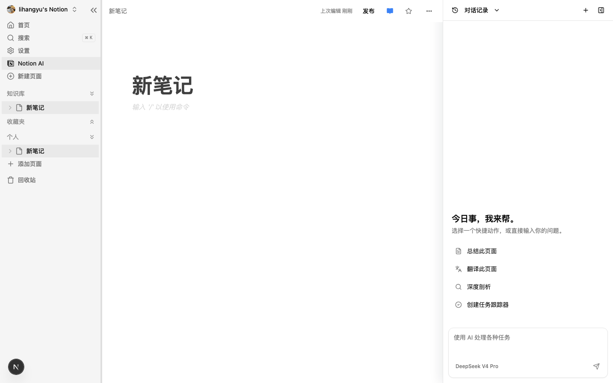
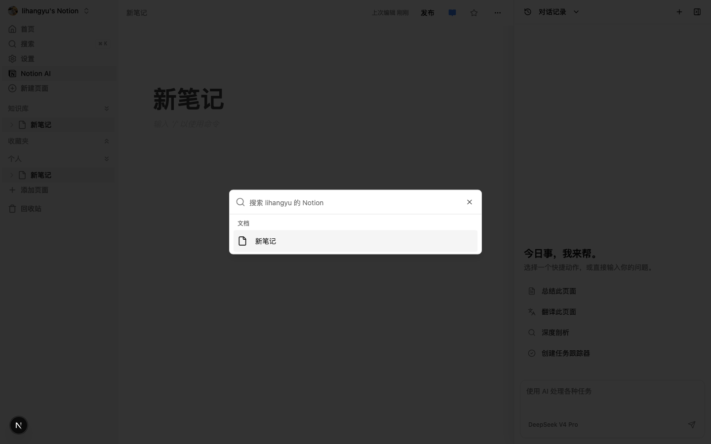

# My-Notion Web

基于 Next.js 的 Notion 克隆 Web 应用，提供类似 Notion 的文档编辑和管理功能。

## 🚀 体验地址

[https://notion-j9zj.vercel.app/](https://notion-j9zj.vercel.app/)

## 📸 项目截图

### 首页（亮色主题）


### 首页（暗黑主题）


### 文档编辑页面


### AI 聊天页面


### AI 思考过程可视化



## 功能特性

- 📝 **富文本编辑器**：基于 BlockNote 的强大编辑器，支持多种内容格式
- 🔐 **用户认证**：使用 Clerk 实现安全的用户登录和注册
- 🗄️ **数据存储**：使用 Convex 作为后端数据库，提供实时数据同步
- 🤖 **AI 智能对话**：基于 RAG 技术的智能对话功能，利用用户文档作为知识库，提供精准的文档问答服务
  - **已实现**：RAG 检索流程全部重构到后端，引入 Qdrant 向量数据库，基于余弦相似度的向量检索，动态提示词配置，AI思考过程可视化，用户隔离的持久化对话历史记录，流式响应体验，RAG动态增量更新，深度思考能力，多模态支持，智能工具调用系统
  - **未来规划**：向量检索策略优化（分层和混合检索），支持多种格式文档检索（PDF、Markdown等），更高级的检索优化
- 🎨 **响应式设计**：适配不同屏幕尺寸的现代 UI
- 🌙 **主题色切换**：支持亮色和深色主题切换
- 🌐 **全栈国际化架构**：Next.js 服务端渲染 + Clerk 鉴权认证 + Convex 实时数据 + Tailwind CSS + Shadcn 响应式设计，集成 next-intl 实现多语言支持（中、英、繁体已上线）
- 🔍 **文档搜索**：快速搜索和定位文档
- 📁 **文档管理**：支持文档的创建、编辑、归档和删除
- ⭐ **收藏功能**：支持收藏重要文档，方便快速访问

## 技术栈

### 前端
- **Next.js** 16 - 现代化 React 框架
- **React** 19 - 用户界面库
- **TypeScript** - 类型安全的 JavaScript
- **Tailwind CSS** - 实用优先的 CSS 框架
- **BlockNote** - 富文本编辑器
- **Shadcn UI** - 基于 Radix UI 的可访问性组件库
- **Clerk** - 用户认证和管理
- **Sonner** - 优雅的通知系统

### 后端
- **Convex** - 实时后端数据库
- **Edge Store** - 边缘存储服务
- **Qdrant** - 向量数据库（用于 RAG 检索）

### AI/大语言模型
- **LangChain** - AI 应用开发框架
- **通义千问** - 大语言模型
- **OpenAI SDK** - 直接调用大模型 API

## 快速开始

### 前提条件
- Node.js 22.0 或更高版本
- pnpm 包管理器
- Convex 账号
- Clerk 账号
- Edge Store 账号
- Qdrant 账号（用于向量数据库）

### 安装步骤

1. **克隆仓库**
   ```bash
   git clone https://github.com/HaveNiceDa/Notion.git
   cd notion/apps/web
   ```

2. **安装依赖**
   ```bash
   pnpm i
   ```

3. **配置环境变量**
   创建 `.env.local` 文件并添加以下环境变量：
   ```env
   # Convex
   CONVEX_DEPLOYMENT=your-convex-deployment
   NEXT_PUBLIC_CONVEX_URL=your-convex-url

   # Clerk
   NEXT_PUBLIC_CLERK_PUBLISHABLE_KEY=your-clerk-publishable-key
   CLERK_SECRET_KEY=your-clerk-secret-key
   CLERK_JWT_ISSUER_DOMAIN=your-clerk-jwt-issuer-domain

   # Edge Store
   EDGE_STORE_ACCESS_KEY=your-edge-store-access-key
   EDGE_STORE_SECRET_KEY=your-edge-store-secret-key

   # Qdrant
   NEXT_PUBLIC_QDRANT_URL=your-qdrant-url
   NEXT_PUBLIC_QDRANT_API_KEY=your-qdrant-api-key

   # LLM (可选)
   LLM_API_KEY=your-llm-api-key
   ```

4. **启动开发服务器**
   ```bash
   pnpm start
   ```
   应用将在 `http://localhost:3000` 运行。

## 环境变量配置

### Convex
- `CONVEX_DEPLOYMENT` - Convex 部署 ID
- `NEXT_PUBLIC_CONVEX_URL` - Convex 应用 URL

### Clerk
- `NEXT_PUBLIC_CLERK_PUBLISHABLE_KEY` - Clerk 可发布密钥
- `CLERK_SECRET_KEY` - Clerk 密钥
- `CLERK_JWT_ISSUER_DOMAIN` - Clerk JWT 颁发者域

### Edge Store
- `EDGE_STORE_ACCESS_KEY` - Edge Store 访问密钥
- `EDGE_STORE_SECRET_KEY` - Edge Store 密钥

### Qdrant
- `NEXT_PUBLIC_QDRANT_URL` - Qdrant 向量数据库 URL
- `NEXT_PUBLIC_QDRANT_API_KEY` - Qdrant API 密钥

### LLM (可选)
- `LLM_API_KEY` - 通义千问 API 密钥

## 项目结构

```
web/
├── src/                          # 源代码目录
│   ├── app/                      # Next.js 应用路由
│   │   ├── [locale]/             # 国际化路由
│   │   │   ├── (main)/           # 主应用布局
│   │   │   │   ├── (AI)/         # AI 功能模块
│   │   │   │   │   └── Chat/     # 聊天功能
│   │   │   │   ├── (routes)/     # 主路由页面
│   │   │   │   │   └── documents/ # 文档管理
│   │   │   │   └── _components/  # 主应用通用组件
│   │   │   ├── (marketing)/      # 营销页面
│   │   │   ├── (public)/         # 公共页面
│   │   │   └── demo/             # BlockNote 演示页面
│   │   └── api/                   # API 路由
│   ├── components/                # 可复用组件
│   ├── config/                    # 配置文件
│   ├── hooks/                     # 自定义 Hooks
│   ├── i18n/                      # 国际化相关
│   └── lib/                       # 工具函数库
├── convex/                        # Convex 后端
├── public/                        # 静态资源
└── README.md
```

## 注意事项

- **Clerk 配置**：确保在 Clerk 控制台中正确配置应用，特别是 JWT 颁发者域
- **Convex 部署**：运行 `npx convex dev` 确保 Convex 后端正确部署
- **Edge Store 配置**：确保 Edge Store 访问密钥和密钥正确配置
- **Qdrant 配置**：确保 Qdrant 向量数据库 URL 和 API 密钥正确配置
- **React 19/Next 16 严格模式**：BlockNote 目前尚不兼容 React 19 / Next 16 的 StrictMode 模式，请暂时禁用 StrictMode 模式
