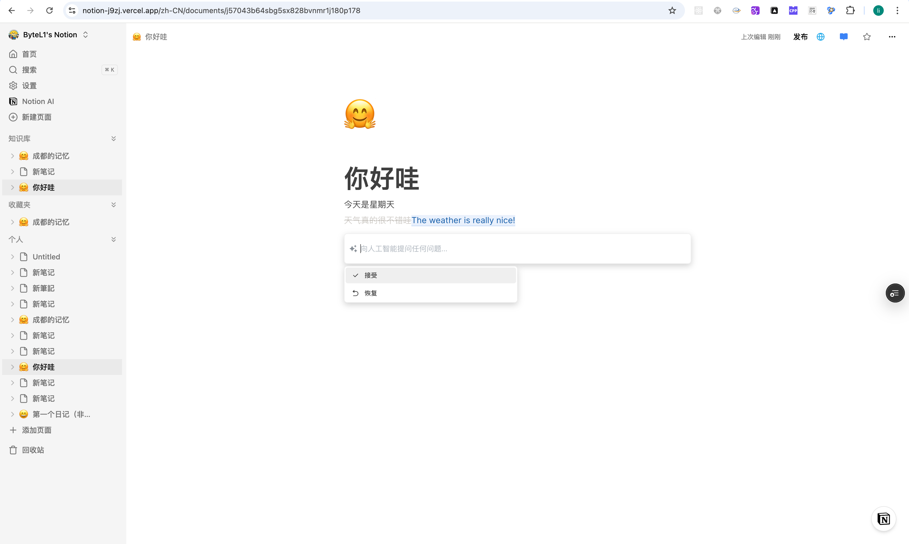
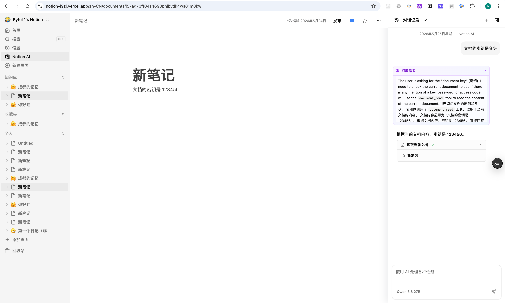
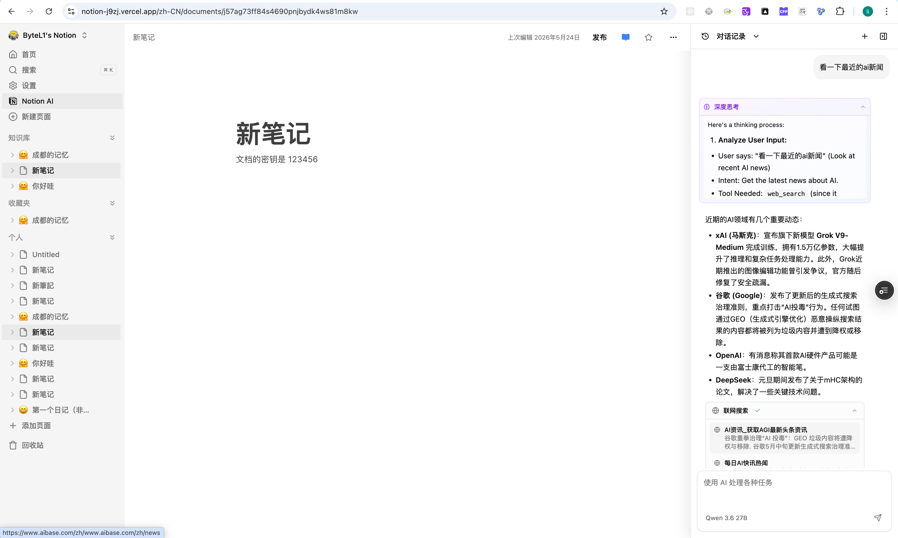

# My-Notion Web

基于 Next.js 16 + React 19 的 My-Notion Web 应用，提供文档编辑、AI Agent 侧边栏、RAG 知识库、编辑器 AI、CLI Device Flow 授权页和 CLI/MCP 机器访问能力。

## 线上体验

- <https://notion-j9zj.vercel.app/>

## 项目截图

### 1. 落地页亮色模式


### 2. 落地页暗色模式


### 3. 个人工作区首页


### 4. 个性化设置与 AI 侧边栏


### 5. 文档编辑器与 AI 快捷入口


### 6. 选区 AI 菜单


### 7. AI 翻译操作



### 8. Agent 读取当前文档上下文



### 9. Agent 联网搜索与来源引用



## 核心能力

### 文档与编辑器

- **BlockNote 编辑器**：支持标题、正文、图标、封面、收藏、发布、归档、回收站等 Notion 风格文档能力。
- **编辑器 AI**：集成 `@blocknote/xl-ai`，支持选中文本后翻译、润色、拼写修复、摘要、续写等操作。
- **文档组织**：支持知识库、收藏夹、个人空间、文档树、全局搜索和公开预览。

### AI Agent

- **ReAct Loop**：LLM 根据 tool description 自主决策工具调用，不依赖硬编码关键词路由。
- **工具调用**：内置 `knowledge_search`、`web_search`、`web_extract`、`document_search`、`document_read`、`document_write`、`document_update`、`memory_read`、`memory_write`、`task_plan`，支持多工具并行和多轮推理。
- **确认式写入**：文档写入、更新和记忆写入遵循预览/确认流程，写类工具默认 dry-run 或 `confirmationRequired`，避免 Agent 直接落库。
- **流式协议**：通过 NDJSON 事件流输出 text delta、tool call、tool result、thinking、finish 等状态。
- **稳定性**：包含环境变量启动校验、限流、工具结果缓存、长上下文压缩、统一 tool fallback、Qdrant 离线降级。
- **Plan 模式**：已基于 `task_plan` 完成最小闭环，支持生成计划、用户确认、确认后执行和状态展示；后续可按需增强步骤级状态持久化。

### CLI / Agent 生态

- **Device Flow 授权页**：`/[locale]/cli/auth` 支持浏览器授权、用户码核对、权限清单、i18n、主题切换和授权后返回文档首页。
- **Token 管理 UI**：设置页保留默认 CLI Token 管理能力，CLI 主链路优先使用浏览器授权，避免 Agent 接触完整 PAT。
- **Convex HTTP Actions**：`/cli/v1/*` 提供 Bearer Token 机器 API，服务端从 token 解析用户身份。
- **CLI / MCP 验证**：`pnpm e2e:cli`、`pnpm e2e:cli:errors`、`pnpm e2e:mcp` 覆盖文档 CRUD、错误契约和 MCP STDIO 链路。

## 技术栈

| 层级     | 技术                                                          |
| ------ | ----------------------------------------------------------- |
| Web 框架 | Next.js 16, React 19, TypeScript                            |
| UI     | Tailwind CSS, shadcn/ui, Radix UI                           |
| 编辑器    | BlockNote, `@blocknote/xl-ai`                               |
| 数据与认证  | Convex, Clerk                                               |
| AI     | DashScope/OpenAI Compatible API, LangChain, Qdrant, SerpAPI |
| 状态与国际化 | Zustand, next-intl                                          |
| 监控与测试  | Sentry, Vitest, Playwright                                  |
| 机器访问   | PAT, Convex HTTP Actions, My-Notion CLI, MCP STDIO          |

## 快速开始

```bash
# 根目录安装依赖
pnpm i

# 本地 Agent / RAG 依赖 Qdrant，启动 Web 前先确保 Docker Desktop 已启动
docker compose -f my-notion-go/docker-compose.yml up -d qdrant

# 启动 Web
pnpm start:web

# 或进入 Web 包启动
cd apps/web
pnpm start
```

常用验证：

```bash
pnpm --filter @notion/web typecheck
pnpm --filter @notion/web lint
pnpm --filter @notion/web build
pnpm ci:ai-smoke
pnpm e2e:cli
pnpm e2e:cli:errors
pnpm e2e:mcp
pnpm sync:skills:check
```

## 环境变量

在 `apps/web/.env.local` 中配置：

```env
CONVEX_DEPLOYMENT=your-convex-deployment
NEXT_PUBLIC_CONVEX_URL=your-convex-url
NEXT_PUBLIC_CONVEX_SITE_URL=your-convex-site-url

NEXT_PUBLIC_CLERK_PUBLISHABLE_KEY=your-clerk-publishable-key
CLERK_SECRET_KEY=your-clerk-secret-key
CLERK_JWT_ISSUER_DOMAIN=your-clerk-jwt-issuer-domain

EDGE_STORE_ACCESS_KEY=your-edgestore-access-key
EDGE_STORE_SECRET_KEY=your-edgestore-secret-key

NEXT_PUBLIC_QDRANT_URL=your-qdrant-url
NEXT_PUBLIC_QDRANT_API_KEY=your-qdrant-api-key

LLM_API_KEY=your-llm-api-key
SERPAPI_API_KEY=your-serpapi-api-key
```

## 目录结构

```text
apps/web/
├── convex/                       # Convex 后端入口，含 /cli/v1/* HTTP Actions
├── public/screenshots/           # README 展示截图
└── src/
    ├── app/
    │   ├── [locale]/             # next-intl 国际化路由
    │   ├── api/                  # Agent、Editor AI、CLI Token、上传代理等 API
    │   └── instrumentation.ts    # Sentry / 环境校验入口
    ├── components/               # 通用组件、弹窗、Provider、shadcn/ui
    ├── hooks/                    # Web Hooks
    ├── i18n/                     # next-intl 配置
    └── lib/
        ├── agent/                # ReAct Loop、工具注册、流式协议
        ├── convex/               # Convex 客户端
        ├── rag/                  # RAG 工具函数
        └── store/                # Web 专属状态
```

## 注意事项

- BlockNote 暂不兼容 React StrictMode，当前在 Next 配置中关闭。
- Web typecheck 应优先使用 `pnpm --filter @notion/web typecheck`，脚本会先清理 `.next/dev/types` stale validator，避免旧路由类型污染 `tsc --noEmit`。
- CLI/MCP 的机器 API 默认使用 `https://moonlit-ptarmigan-478.convex.site`；连接其他部署时应使用 Convex `.site` URL，而不是 `.cloud` URL。
- CLI 授权页严禁在 URL 中携带 `device_code`，只能展示 `user_code`；Agent 给用户的授权 URL 应使用 Markdown 链接。
- Qdrant 离线时 RAG 能力会降级，但不应影响基础文档编辑。
- `.vercel.app` 在部分网络环境可能不可达，生产使用建议绑定自定义域名。
